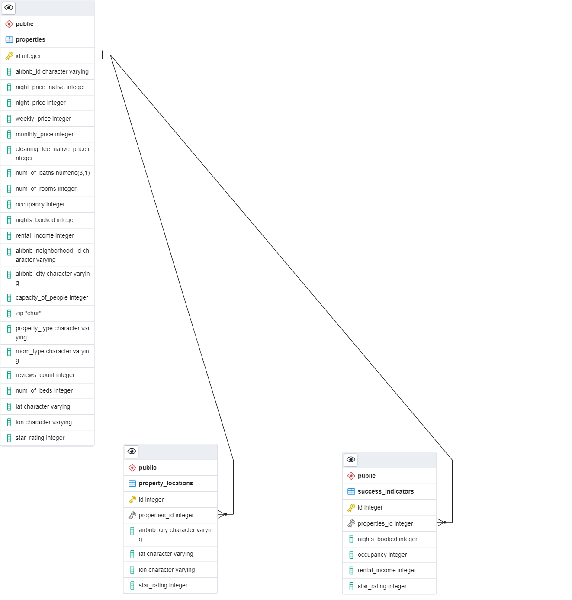
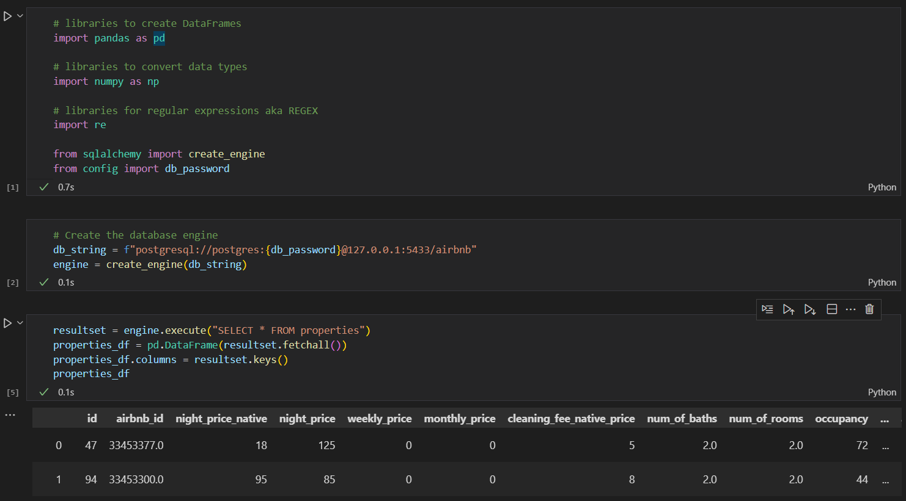

# AirBnB Database Description

## Datasource Descirption
The data obtained from the MashAdvisor website was obtained by sending a request to a JSON  API call. The JSON data was extracted and placed into three (3) CSV files, one for each city (Orlando, Tampa, and Kissimmee). The CSVs were then combined and preliminary pre-processing of the data was performed to produced the clean_all_property_data.csv.

## Database Creation
To create the tables for the AirBnB database, execute the "create_schema.sql" script. This SQL script will create three (3) tables: properties, property_locations, and success_indicators. The properties tables must be created first and populated by importing the data from the clean_all_property_data.csv files. Upon population of the table, the remainder of the script must be run so that the data in the properties table can be cleaned, datatypes can be reset, and the other two (2) tables can be created. This script will also create the foreign keys within the properties_locations and success_indicators tables that relate back to the properties table. 

## Database Connections
To connect to this database, use the SQLAlchemy package. Below is sample of you you can connect to the database.

