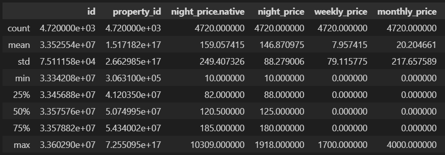
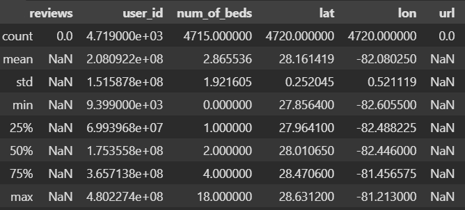
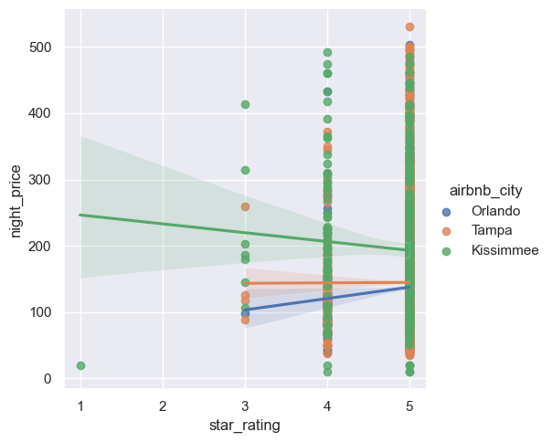
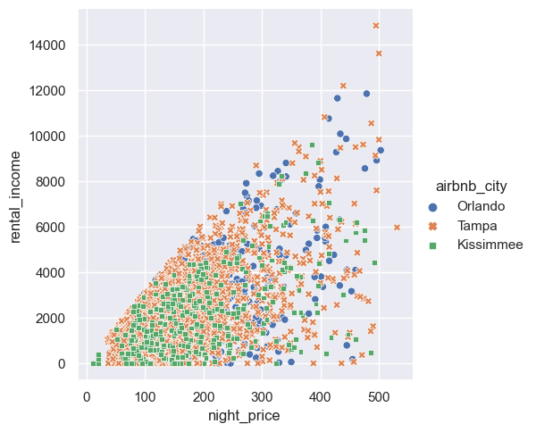
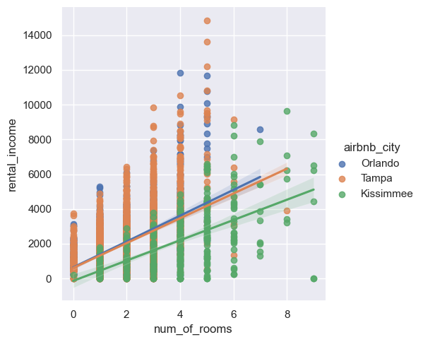

# AirBnb Final Project: Exploratory Data Analysis
## Source Data
Source data regarding AirBnB listings for the cities of Tampa, Kissimmee, and Orlando were obtained from MashVisor using an API call.

More information about the data fields can be found at:
https://www.mashvisor.com/api-doc/#short-term-rentals

## API Info
Data was obtained from the API labeled as "Get Listings".
https://api.mashvisor.com/v1.1/client/airbnb-property/active-listings?state={state}&city={city}&items={20}&page={pagenum}

## File Description
### get_json_data.ipynb
The JSON data was parsed and saved to invidual JSON files for each city. 

### get_json_dta.ipynb
Afterwards, the individual json data for each city was merged into one file called listings_all.csv.

### analyze_data.ipynb
This files was used to review each column to make a determination whether to keep it or not. Certain columns were dropped and the following CSV files were created.
* clean_all_property_data.csv

***PLEASE NOTE: all csv files can be linked together using th4e "id" column as the primary key.

## Data Analysis
Exploratory data analysis was performed on the property listings. 

### properties_df.Describe()

### Effects of Nightly Price on Star Ratings
It seems that star ratings are usually either 3, 4 or 5 star ratings.

### Effects of Nightly Price on Rental Income
It seems nightly price and rental income for Kissimmee is typically lower than that of Orlando and Tampa. Tampa dn Orlando has a wider and higher range of nightly pricing and rental income.

### Effects of Number of Rooms on Rental Income
Orlando and Tampa can command higher rental incomes overall for the same number of rooms as Kissimme.

### Recommend Target
It is recommend that the rental_income field be the target of the machine learning process.

