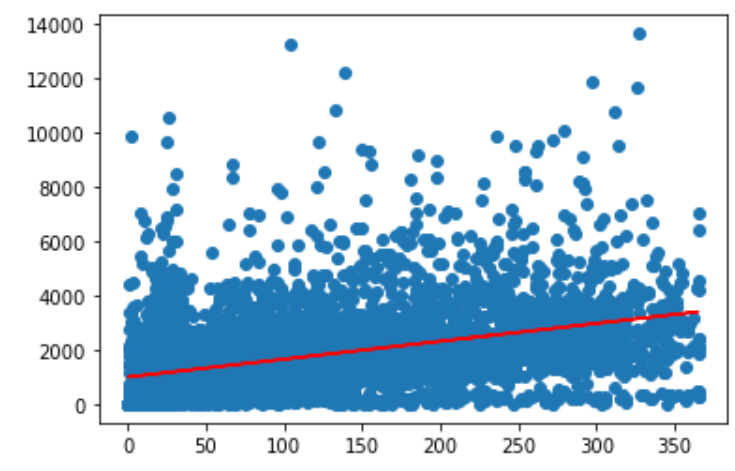
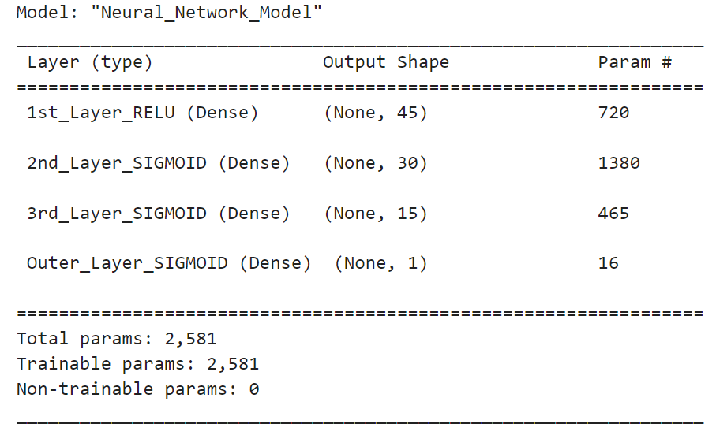
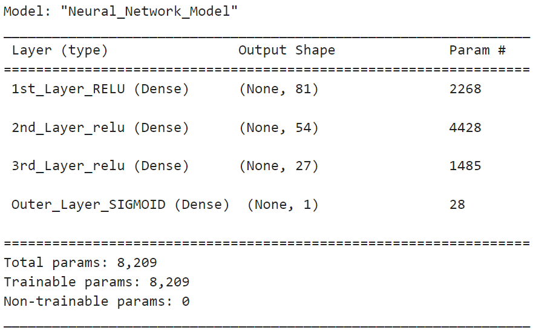
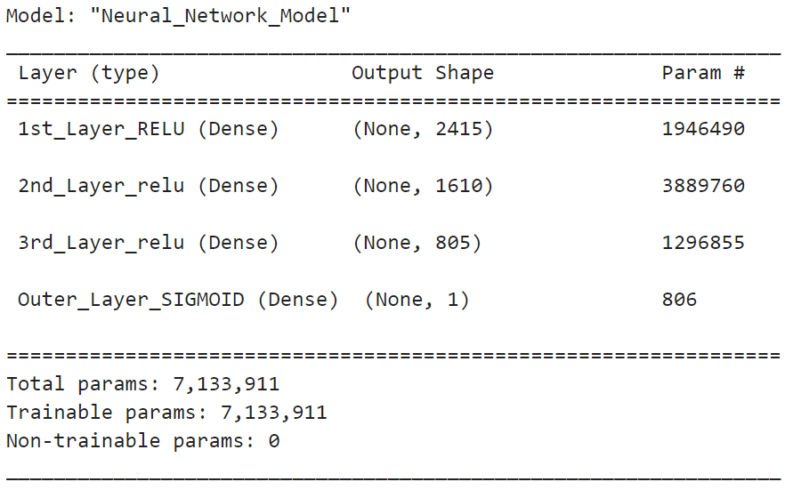
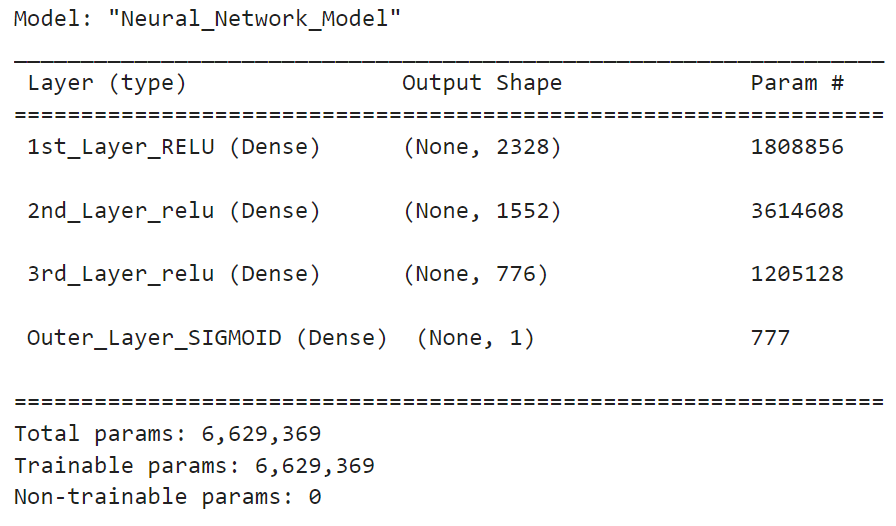

# Machine-Learning

## Overview

In order to determine the success or failure of Airbnb properties we will be using a Linear Model. Based on our cleaned dataset we will examine the number of nights booked and it's overall effect on revenue generated by the property. It is expected that there will be a clear correlation between these two measures.

## First Round of Machine Learning

Our initial linear model was achieved using the following code and rendered a scatter plot that indicates the rate at which nights booked can generate revenue. Below is a scatter plot with a line presenting the overall projected path.
 

[SimpleRegression2.ipynb](./SimpleRegression2.ipynb)
 

## Second Round of Machine Learning

In our second round of Machine Learning we are using a neural network. The model that we built has started off inconclusive, but with additional optimization should yield some useable results to answer our questions. So far, the preprocessing steps taken have been to remove all low information columns and use one hot encoder to handle categorical data.

[Final_ML](./Final_ML.ipynb)
 

## Third Round of Machine Learning

In our third round of Machine Learning we continued using a neural network. In this iteration, we binned all categories of data excluding rental_income which is the target of our machine learning model. This allowed us to widen our data set and use one hot encoder on the newly binned columns. As you can see by our model below, our parameters almost doubled using this strategy. We also switched from sigmoidal to relu to test using a different function.

[Final_ML_2](./Final_ML_2.ipynb)
 

## Fourth Round of Machine Learning

In our fourth round of Machine Learning we continued using a neural network. This time instead of binning we used the get_dummies method. This drastically increased our parameters of our model. We went from a little over 8,000 to over 7 million. We stayed true to testing functions in this model from the last attempt.

[Final_ML_3](./Final_ML_3.ipynb)
 

## Fifth Round of Machine Learning

In our fifth and final round of machine learning we tried to remove as many outliers as possible to help fine tune and optimize our model. We remained true to the get_dummies method and testing functions of the last model. The removed outliers reduced our parameters slightly from attempt down to about 6.6 million.

[Final_ML_4](./Final_ML_3.ipynb)
 

All of the machine learning models above had low accuracy scores. The scores for the Random Forest Classifiers faired a little better. However, the process in creating and training the models as well as implementing accuracy tests was the true objective. As Justin Kan said, "The journey is it's own reward."
